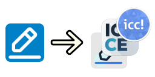

# Seewo-DesktopAnnotation-Replacement 希沃批注替换

替换 `希沃桌面 2.0+` 自带的桌面批注程序为其它屏幕批注程序，支持 ICC-CE 1.7.18.7- 与 ICA 衍生版，仅支持在 Windows 10 上运行。

> [!CAUTION]
> **破坏性更改！** 
> v4.0.0 版本已弃用「映像劫持」替换方法，改为替换希沃桌面批注文件方法。 
> 升级至 v4.0.0 后 ，程序会提示「是否删除旧的映像劫持项」，请退出安全软件并单击「是」以删除。 
> 开发者不会受理因保留映像劫持项而产生的任何 bug。 

## 使用方法

1. 从 [releases](https://github.com/EmerMine/Seewo-DesktopAnnotation-Replacement/releases) 页面下载最新发行版，并解压到一个合适的地方。

2. 运行 `Annotation.exe`，单击 `替换` 按钮。

## 支持软件列表

下列软件与本程序搭配使用最为完美：
- [Dongsf119/Ink-Canvas-Artistry](https://github.com/Dongsf119/Ink-Canvas-Artistry)
- [Huchangzhi/Ink-Canvas-Artistry-hcz](https://github.com/Huchangzhi/Ink-Canvas-Artistry-hcz)
- [MiraEvo/Ink-Canvas-Artistry](https://github.com/MiraEvo/Ink-Canvas-Artistry)
- [DaleGreen123/Ink-Canvas-DeepRethink](https://github.com/DaleGreen123/Ink-Canvas-DeepRethink)
- [MKStoler1024/InkCanvasforDrawing](https://github.com/MKStoler1024/InkCanvasforDrawing)
- [Tayasui-rainnya/Ink-Canvas-Artistry](https://github.com/Tayasui-rainnya/Ink-Canvas-Artistry)
- [TomKe123/Ink-Canvas-Artistry](https://github.com/TomKe123/Ink-Canvas-Artistry)
- [awesome-iwb/icc-20240610-stable](https://github.com/awesome-iwb/icc-20240610-stable) 请注意您可能无法访问该链接
- [InkCanvasForClass/community](https://github.com/InkCanvasForClass/community)

下列软件与本程序搭配使用时，存在一些已知问题：

- [InkCanvas/Ink-Canvas-Artistry](https://github.com/InkCanvas/Ink-Canvas-Artistry)
- [BaiYang2238/Ink-Canvas-Better](https://github.com/BaiYang2238/Ink-Canvas-Better)
- [jizilin6732/Ink-Canvas-Attention](https://github.com/jizilin6732/Ink-Canvas-Attention)
- [pigeons2023/Ink-Canvas-Basic](https://github.com/pigeons2023/Ink-Canvas-Basic)

已知问题：

- 浮动栏不能自动居中
- 笔按钮保持为蓝色高亮样式，即使未选中
- 屏幕两侧的取消收纳按钮仍然存在

本程序不对下列软件提供支持：

- [WXRIW/Ink-Canvas](https://github.com/WXRIW/Ink-Canvas)
- [clover-yan/Ink-Canvas-Plus](https://github.com/clover-yan/Ink-Canvas-Plus)
- [LiuYan-xwx/InkCanvasForClass-Remastered](https://github.com/LiuYan-xwx/InkCanvasForClass-Remastered)

## 参数说明

| 参数 | 描述 |
| --- | --- |
| `-settings` | 打开设置窗口 |
| `-debug` | 开启调试模式 |
| `-run_annotation_app` | 启动批注软件 |